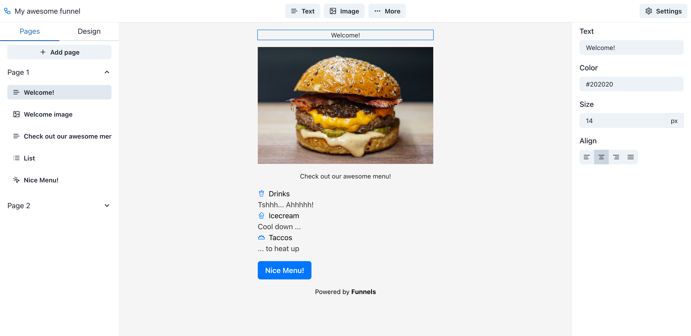

# funnels

[](https://github.com/prettier/prettier)
[](https://github.com/malcodeman/funnels/blob/master/LICENSE)

Free JSON funnel builder.



## Getting started

```
git clone https://github.com/malcodeman/funnels.git
cd funnels
yarn install
yarn dev
```

## Testing

```
"e2e:ci": "playwright test",
"e2e:ui": "playwright test --ui"
```

## Todos

- Make funnel name editable
- Add remove page button
- Add remove block button
- Add support for youtube links
- Add support for more properties for all the blocks

## Project structure

- `src/lib` - Used for constants and utility functions
- `src/hooks` - Used for reusable react hooks
- `src/components` - Used for reusable components

## License

[MIT](./LICENSE)
